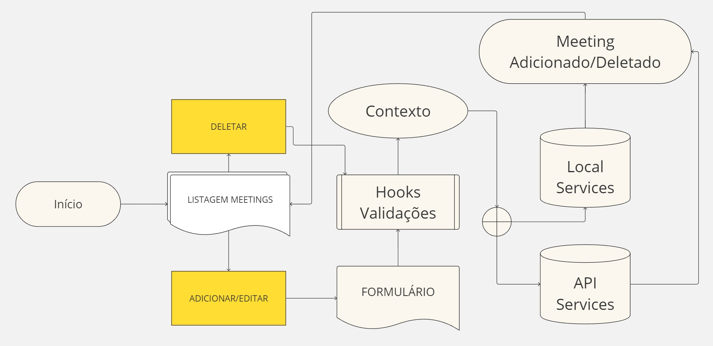

# Desafio Front - Meetings

## Solução para o desafio de criação de um modulo de agendamento de reuniões.

### A ideia principal foi demonstrar minhas habilidades através de alguns exemplos e não desenvolver uma solução robusta e com suíte de testes completa.

### Requisitos funcionais

- [x] CRUD de reuniões com objetivo, horário (início e fim), foto opcional e colaboradores.
- [x] Manter os dados salvos (IndexedDB), caso o usuário feche ou atualize a página.
- [x] Validação de conflitos de horário em relação aos colaboradores.
- [x] Validação de horário, evitar o registro de uma reunião no passado.
- [x] Validação de preenchimento de campos.

### Requisitos não funcionais

- [x] Código com uma boa qualidade, em um repositório no github
- [x] Qualquer desenho ou diagrama que ilustra as decisões de modelagem da aplicação
- [x] Utilizar Context API
- [x] Ter uma estrutura para no futuro a aplicação se comunicar com APIs
- [x] Testes de software

### Principais Tecnologias

- React / Vite
- Mateiral UI
- Jest, Testing-library/react, Fake-indexeddb (testes)

### Comandos

- Instalar

  - `npm install`

- Rodar para desenvolvimento

  - `npm run dev`

- Preparar para produção

  - `npm run build`

- Testes

  - `npm run test`

### Diagrama

